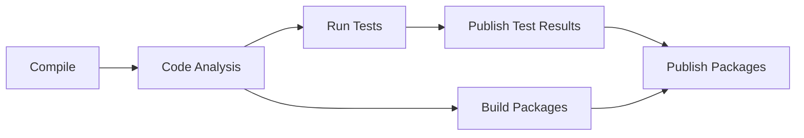
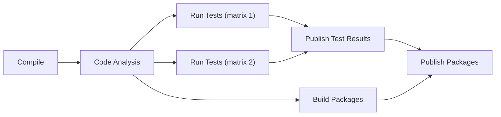

# Endjin.RecommendedPractices.GitHubActions

This repository contains [re-usable GitHub Action workflows](https://docs.github.com/en/actions/using-workflows/reusing-workflows) and [composite actions](https://docs.github.com/en/actions/creating-actions/creating-a-composite-action) for our standardised CI processes.

## Reusable Workflows

### Multi-Job Workflows
These run the logical phases of the build process using discrete jobs, which can be beneficial for large builds due to the parallelisation when running tests and building packages.

- `scripted-build-pipeline` - encapsulates our standard CI build process, using separate jobs for Compile, Test, Package & Publish phases
- `scripted-build-matrix-pipeline` - as above, except the Test phase includes [matrix](https://docs.github.com/en/actions/writing-workflows/choosing-what-your-workflow-does/running-variations-of-jobs-in-a-workflow) support

The diagram below shows the high-level process that these multi-job workflows implement:

The diagram below illustrates the different high-level process for these multi-job matrix workflows:

### Single-Job Workflows
These run the build process as a single job, closely mimicking the local developer build.
- `scripted-build-single-job-pipeline` - encapsulates our standard CI build process, using a single job

This diagram shows the high-level process that these single-job workflows implement:

## Composite Actions
- `prepare-env-vars-and-secrets` - provides a workaround for not natively being able to pass arbitrary environment variables and secrets to a reusable workflow. Based on assembling the required values into 2 well-known variables that act as containers for the variables and secrets that need to be passed.
- `run-scripted-build` - encapsulates the steps for executing our [PowerShell-based build tooling](https://www.powershellgallery.com/packages/Endjin.RecommendedPractices.Build) - typically used via one of the above reusable workflows.
- `set-env-vars-and-secrets` - the consuming side of the workaround for passing arbitrary environment variables and secrets. Unwraps the bundled environment variables and secrets so they are available to the running workflow.

## Examples

The following serve as examples of using the reusable workflows found in this repo:

- [ci.yml](.github/workflows/ci.yml) - used for validating changes to the `scripted-build-pipeline` reusable workflow
- [ci-matrix.yml](.github/workflows/ci-matrix.yml) - used for validating changes to the `scripted-build-matrix-pipeline` reusable workflow
- [ci-single-job.yml](.github/workflows/ci-single-job.yml) - used for validating changes to the `scripted-build-single-job-pipeline` reusable workflow

